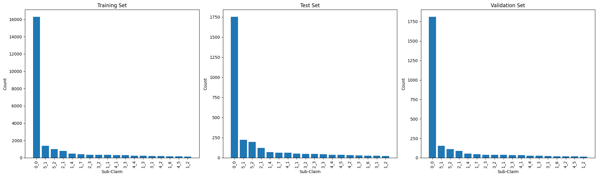
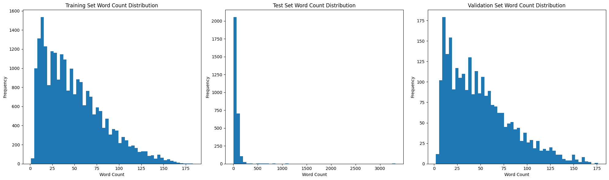
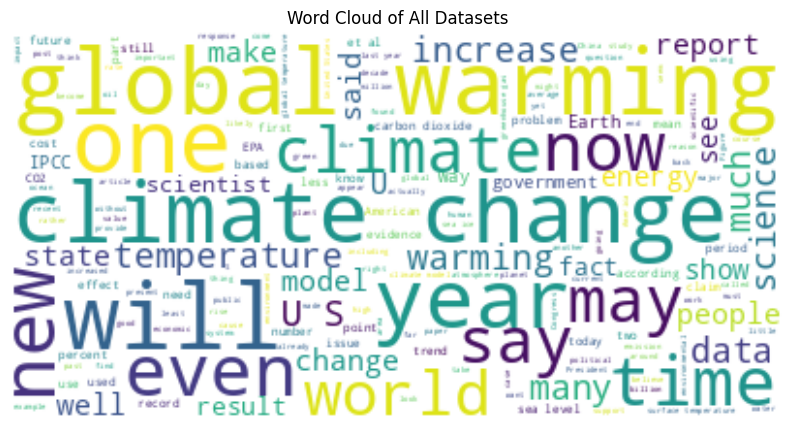

# Detection of Climate Misinformation Claims

## Overview
This project tackles the task of classifying climate-related claims into fine-grained sub-claim categories, following the taxonomy from Coan et al. (2021). Using the sub-claim configuration of the [murathankurfali/ClimateEval](https://huggingface.co/datasets/murathankurfali/ClimateEval/tree/main/exeter/sub_claim) dataset, we evaluate a spectrum of approaches in three phases: (1) zero-shot prompting, (2) few-shot prompting with limited in-context examples, and (3) advanced methods including PEFT QLoRA, Retrieval-Augmented Generation (RAG), and a TF-IDF + Fully Connected Neural Network (FNN) baseline. Due to resource constraints, few-shot prompting was restricted to a small set of representative examples, and fine-tuning was performed on a random subset of 1,000 training samples. Results show that naive prompting yields near-random performance, while PEFT QLoRA and RAG achieve substantial gains (≈72–74% accuracy). The conventional TF-IDF + FNN approach outperforms all LLM-based methods with 79% accuracy, highlighting the effectiveness of sparse lexical features in this domain. These findings suggest that for narrow, domain-specific classification tasks, traditional methods can surpass small language models unless they are domain-adapted or paired with strong retrieval pipelines.

The project is implemented in four phases:
- **Phase 0 - Exploratory Data Analysis**: Performing an overall dataset analysis to examine data types, distributions, and the most important features.
- **Phase 1 – Zero-Shot Prompting**: Establishing a baseline using direct prompts with no examples.
- **Phase 2 – Few-Shot Prompting**: Improving performance by adding in-context examples.
- **Phase 3 – Advanced Methods**: Exploring multiple approaches including PEFT with QLoRA, Retrieval-Augmented Generation (RAG), and TF-IDF + Fully Connected Neural Networks (FNN).

---

## Dataset
- **Source**: [murathankurfali/ClimateEval - sub_claim configuration](https://huggingface.co/datasets/murathankurfali/ClimateEval/tree/main/exeter/sub_claim)
- **Task**: Multi-class classification with a large number of categories (sub-claims).
- **Splits**: Train, validation, and test (test used strictly for final evaluation).

---
## Metrics

For this project, **accuracy** is used as the main comparison metric.  
The reason for this choice is its **simplicity** and ease of interpretation.  
Since this is a **multi-class classification** task, accuracy provides a straightforward  
yet effective way to compare models based on their overall detection performance.  
It also offers a quick summary of how well the model performs across all categories,  
making it useful for initial benchmarking before diving into more detailed metrics.

**Accuracy**  
Accuracy = Correct Predictions / Total Predictions

**Precision**  
Precision = True Positives / (True Positives + False Positives)

**Recall**  
Recall = True Positives / (True Positives + False Negatives)

**F1-Score**  
F1 = 2 × (Precision × Recall) / (Precision + Recall)

While precision, recall, and F1-score are also reported to capture the nuances of  
per-class performance and class imbalance effects, the primary focus remains on  
accuracy for clear model-to-model comparison.


---

## Exploratory Data Analysis

1. **Data Integrity**  
   - Minimal redundancy: no overlaps between train and validation sets; only one duplicate in the test set.
  

| Split       | Metric    | text   | sub_claim_code | sub_claim |
|-------------|-----------|--------|----------------|-----------|
| **Train**   | Count     | 23,436 | 23,436         | 23,436    |
| **Test**    | Count     | 2,898  | 2,904          | 2,904     |
| **Validation** | Count | 2,605  | 2,605          | 2,605     |
| **Train**   | Unique    | 23,436 | 18             | 18        |
| **Test**    | Unique    | 2,897  | 18             | 18        |
| **Validation** | Unique| 2,605  | 18             | 18        |
| **Train**   | Top       | Truth n 16 The trace gases absorb the radiatio... | 0_0 | No claim |
| **Test**    | Top       | Reality may be a bit simpler, or much more com... | 0_0 | No claim |
| **Validation** | Top    | The linear trends in the graphs are as calcula... | 0_0 | No claim |
| **Train**   | Freq      | 1      | 16,302         | 16,302    |
| **Test**    | Freq      | 2      | 1,754          | 1,754     |
| **Validation** | Freq  | 1      | 1,812          | 1,812     |

   
2. **Label Distribution**  
   - Labels are highly imbalanced. The majority of examples belong to "No claim," which makes up ~⅔ of all data points.
   - This imbalance may bias models toward predicting the dominant class.

<figure align="center">
  
  <figcaption><em>Figure 1:</em>The histograms of the three sets suggest that they share a similar overall data distribution, indicating that validation and test set performance should reliably reflect the model’s performance on the training data. However, the sets are imbalanced with respect to label distribution, with the majority of labels belonging to the 'No claim' category, which may affect the fairness and generalization of the models.</figcaption>
</figure>


3. **Feature Characteristics**  
   - Text lengths vary significantly between samples, which may affect sequence models like LSTMs but less so large language models (LLMs).
   - Word count distribution shows a similar pattern to text length, confirming varied verbosity across examples.
  
<figure align="center">
  
  <figcaption><em>Figure 2:</em>The text lengths differ across the datasets, which may affect the performance of models that are sensitive to input size, such as RNNs.</figcaption>
</figure>


4. **Implications for Modeling**  
   - Class imbalance requires careful consideration in evaluation.
  
5. **Repetitive words in all sets**

<figure align="center">
  
  <figcaption><em>Figure 3:</em>The wordcloud suggests that the most repetitive words are global, climate, change, year, and warming.</figcaption>
</figure>


---
## Environment Setup

```bash
git clone https://github.com/alizoljodi/Detection_of_Climate_Misinformation_Claims.git
cd Detection_of_Climate_Misinformation_Claims
pip install -r requirements.txt
```

---

## Running the Code

Open the provided Colab notebook:

```bash
# For Google Colab
Open 'Detection_of_Climate_Misinformation_Claims.ipynb' in Colab
Follow the cell execution order for each phase.
```

You can run each phase independently:
- **Phase 1**: Zero-shot
- **Phase 2**: Few-shot
- **Phase 3**: PEFT QLoRA / RAG / TF-IDF + FNN

---

## Methods

### Phase 1 – Zero-Shot Prompting
- **Model**: Gemma 2B
- **Approach**: A simple classification prompt instructing the LLM to output exactly one label from the taxonomy.
- **Observation**: Accuracy was extremely low (≈0.1%), indicating that the small LLM had no prior alignment with this domain.

### Phase 2 – Few-Shot Prompting
- **Model**: Gemma 2B
- **Approach**: Added carefully selected examples from the training set to the prompt.
- **Observation**: Slight improvement over zero-shot but still far from acceptable performance.

### Phase 3 – Advanced Approaches
- **PEFT QLoRA**: Parameter-efficient fine-tuning of Gemma 2B with low-rank adapters.  
- **COT + Self-Consistency**: Chain-of-Thought reasoning with multiple answer paths (poor results in this domain).  
- **RAG**: Retrieval-Augmented Generation using the training set as a knowledge base, retrieving relevant examples before classification.  
- **TF-IDF + FNN**: Conventional machine learning with TF-IDF embeddings and a fully connected network classifier.

---

## Results

| Model / Method            | Accuracy  | Precision | Recall   | F1-Score |
|---------------------------|-----------|-----------|----------|----------|
| Zero-shot (Gemma 2B)       | 0.0010    | 0.6204    | 0.0010   | 0.0020   |
| Few-shot (Gemma 2B)        | 0.0055    | 0.2616    | 0.0055   | 0.0108   |
| PEFT QLoRA (Gemma 2B)      | 0.7198    | 0.6479    | 0.7198   | 0.6733   |
| COT + Self-Consistency     | 0.0000    | 0.0000    | 0.0000   | 0.0000   |
| RAG (Gemma 2B)             | 0.7380    | 0.7419    | 0.7380   | 0.7168   |
| TF-IDF + FNN               | **0.7919**| 0.7873    | 0.7919   | 0.7695   |

---

## Analysis and Reflections

The results demonstrate a substantial gap between naive prompting and methods adapted to the task. Zero-shot prompting performed poorly due to the model’s lack of task-specific knowledge and limited size, while few-shot prompting achieved only marginal gains before plateauing, suggesting that the bottleneck lay in reasoning ability rather than exposure to additional examples. PEFT QLoRA produced a significant jump in performance, confirming that even partial fine-tuning can equip a small model with useful domain knowledge. Retrieval-Augmented Generation (RAG) slightly outperformed fine-tuning, showing the potential of retrieval-based augmentation in specialized tasks. However, the advantage of RAG over fine-tuning may diminish if the latter is trained on the full dataset rather than the restricted subset of 1,000 examples used here. TF-IDF with a fully connected neural network achieved the highest accuracy at 79%, illustrating that conventional methods can outperform small LLMs in narrow, domain-specific classification tasks by leveraging sparse, discriminative features without the need for deep semantic reasoning.

From a practical perspective, TF-IDF + FNN offers near-instant inference and minimal computational overhead, making it well-suited for small- to medium-scale deployments. However, its scalability is limited, as the sparse feature matrix and model parameters require retraining when significant changes occur in the dataset. In contrast, RAG is inherently more scalable for dynamic and evolving knowledge bases, as it can integrate new data directly into the retrieval index without retraining the underlying model, enabling rapid adaptation to emerging misinformation patterns. While both approaches have merits, these scalability differences make RAG more appropriate for long-term deployment in fast-changing domains, despite its higher computational cost during inference.

Limitations of this work include the risk of domain drift, given that the dataset contains historical claims whose language and framing may not generalize to future misinformation narratives, and the amplification of bias caused by the heavy class imbalance toward the “No claim” category, which may lead to systematic under-detection of rarer sub-claims. Addressing these issues could involve hybrid modeling approaches that combine TF-IDF features with transformer embeddings, curriculum-based fine-tuning that gradually introduces the full taxonomy, and data augmentation strategies such as paraphrasing or back-translation to increase the representation of minority classes.

It should also be noted that the experiments were conducted on a limited amount of data due to resource constraints. Consequently, conducting new experiments with access to the full dataset and greater training capacity may influence the absolute performance of the models as well as their relative rankings, potentially altering the conclusions drawn from this comparison.

**Next Steps**:
- Use domain-adapted LLMs pre-trained on climate change discussions.
- Explore more advanced retrieval pipelines.

## Key Takeaways

Our experiments show that naive prompting is ineffective for fine-grained climate misinformation classification, while fine-tuning (**PEFT QLoRA**) and retrieval-based methods (**RAG**) achieve strong improvements. A simple **TF-IDF + FNN** baseline outperformed all LLM-based approaches, highlighting the power of sparse lexical features in narrow domains. **RAG** is more scalable for dynamic datasets, whereas **TF-IDF + FNN** offers low-cost, fast inference but limited adaptability. Due to resource constraints, all experiments were run on reduced training data, meaning results may shift if full datasets and larger training capacity are used.


---


## References
- Coan, T. G., Boussalis, C., & Cook, J. (2021). *Computer-assisted classification of contrarian claims about climate change*. *Scientific Reports, 11*(1), 1–12. [Link](https://www.nature.com/articles/s41598-021-01714-4)  
- [ClimateEval Dataset](https://huggingface.co/datasets/murathankurfali/ClimateEval/tree/main/exeter/sub_claim)  
- Team Google DeepMind & Google Research. (2024). *Gemma: Open models based on Gemini research and technology*. [Hugging Face model card](https://huggingface.co/google/gemma-2b)  
- Lewis, P., Perez, E., Piktus, A., Petroni, F., Karpukhin, V., Goyal, N., ... & Riedel, S. (2020). *Retrieval-Augmented Generation for Knowledge-Intensive NLP Tasks*. *Advances in Neural Information Processing Systems (NeurIPS)*. [arXiv:2005.11401](https://arxiv.org/abs/2005.11401)  
- Wei, J., Wang, X., Schuurmans, D., Bosma, M., Chi, E., Le, Q., & Zhou, D. (2022). *Chain-of-Thought Prompting Elicits Reasoning in Large Language Models*. *Advances in Neural Information Processing Systems (NeurIPS)*. [arXiv:2201.11903](https://arxiv.org/abs/2201.11903)  
- Wang, X., Wei, J., Schuurmans, D., Le, Q., Chi, E., Narang, S., ... & Zhou, D. (2022). *Self-Consistency Improves Chain of Thought Reasoning in Language Models*. [arXiv:2203.11171](https://arxiv.org/abs/2203.11171)  
(https://www.nature.com/articles/s41598-021-01714-4)
- [ClimateEval Dataset](https://huggingface.co/datasets/murathankurfali/ClimateEval/tree/main/exeter/sub_claim)
